# Banking Application

A simple banking application built using **Spring Boot** and **MySQL** that provides functionalities like creating
accounts, withdrawing, depositing, deleting accounts, and retrieving account details.

## Table of Contents

- [Features](#features)
- [Setup and Installation](#setup-and-installation)
- [API Endpoints](#api-endpoints)
- [Output Screenshots](#output-screenshots)
- [Exception Handler](#exception-handler)
- [End Of Project](#end-of-project)

## Features

- **Get All Accounts**: Retrieve a list of all bank accounts.
- **Get Account by ID**: Fetch details of a specific account using an account number.
- **Deposit Money**: Add funds to an account.
- **Withdraw Money**: Deduct funds from an account (ensuring sufficient balance).
- **Delete Account**: Remove an account from the system.

## Setup and Installation

1. Clone the repository:
   ```sh
   git clone https://github.com/your-repo/banking-app.git
   ```
2. Configure MySQL database in `application.properties`:
   ```properties
   spring.datasource.url=jdbc:mysql://localhost:3306/banking_db
   spring.datasource.username=root
   spring.datasource.password=yourpassword
   ```
3. Run the application:
   ```sh
   mvn spring-boot:run
   ```

## API Endpoints

| Method | Endpoint                        | Description       |
|--------|---------------------------------|-------------------|
| GET    | api/v1/thebank/all              | Get all accounts  |
| GET    | api/v1/thebank/find/{accNo}     | Get account by ID |
| PUT    | api/v1/thebank/deposit/{accNo}  | Deposit money     |
| PUT    | api/v1/thebank/withdraw/{accNo} | Withdraw money    |
| DELETE | api/v1/thebank/delete/{accNo}   | Delete an account |
| POST   | api/v1/thebank/new              | Create an account |

## Output Screenshots

Below are screenshots of the application in action:

1. **Add an Account**  
   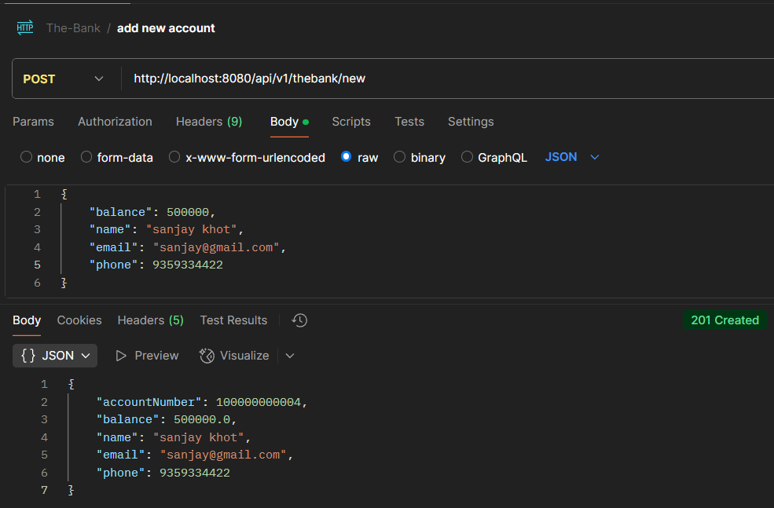

___

2. **find an account**  
   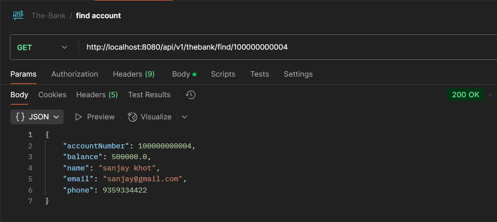

___

3. **find an account with no records**  
   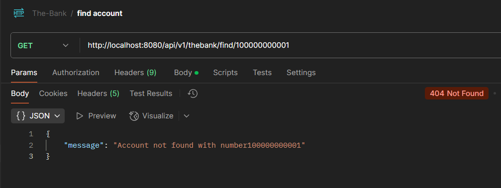

___

4. **deposit an amount**  
   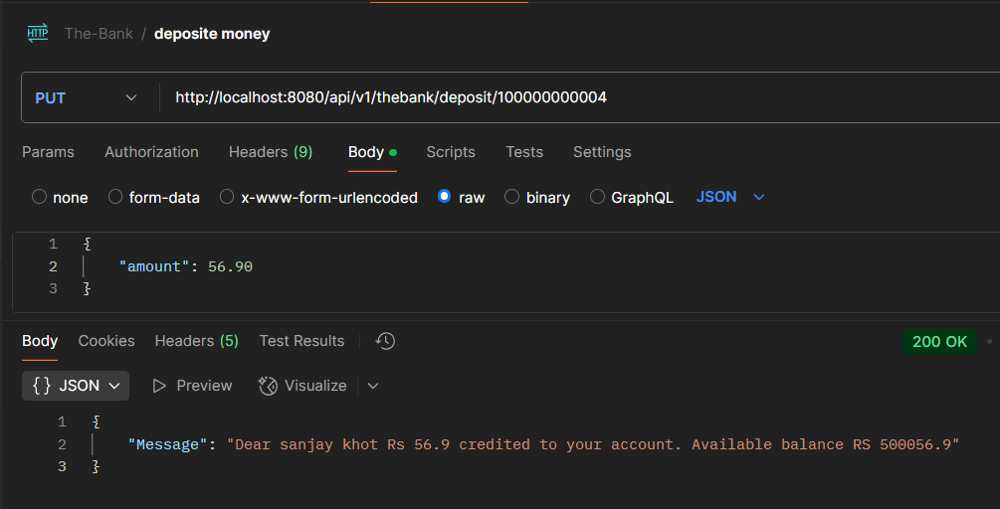

___

5. **deposit an amount with no record**  
   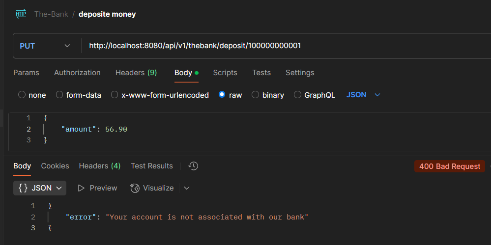

___

6. **withdraw an amount**  
   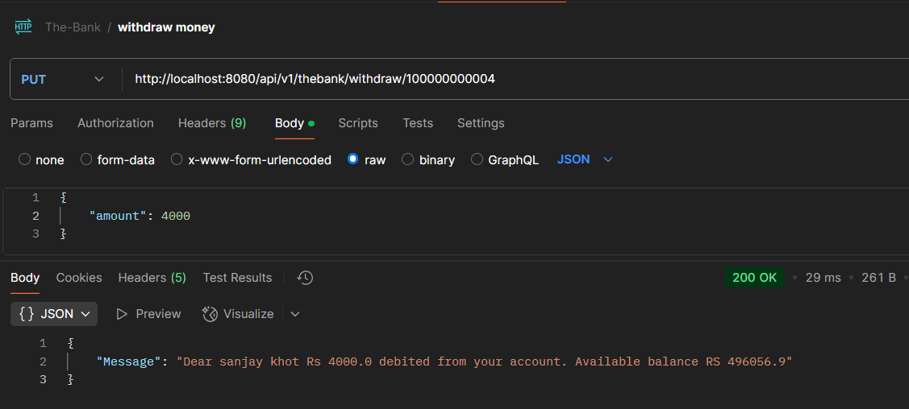

___

7. **withdraw an amount with no record**  
   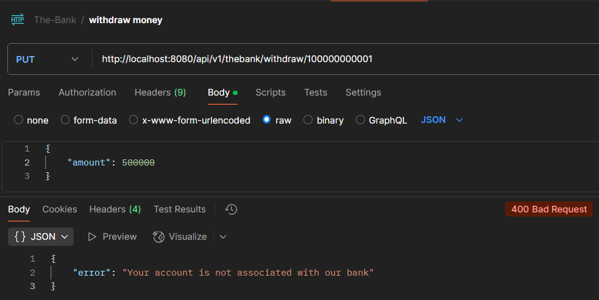

___

8. **minimum balance should be 500**  
   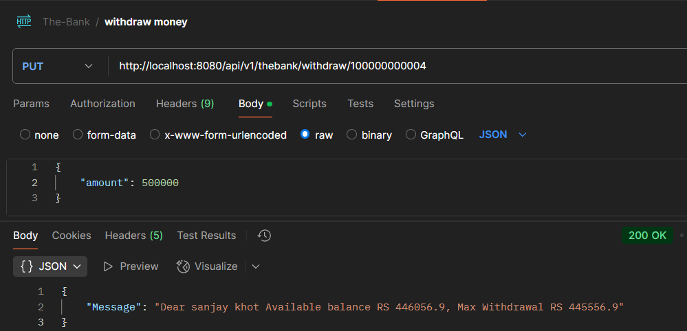

___

9. **Get all Accounts**  
   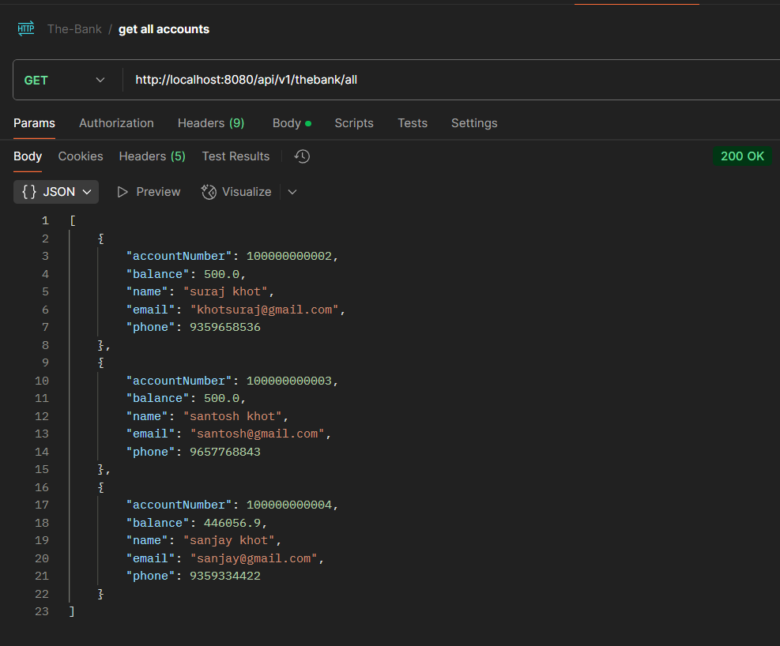

___

10. **Delete an account**  
    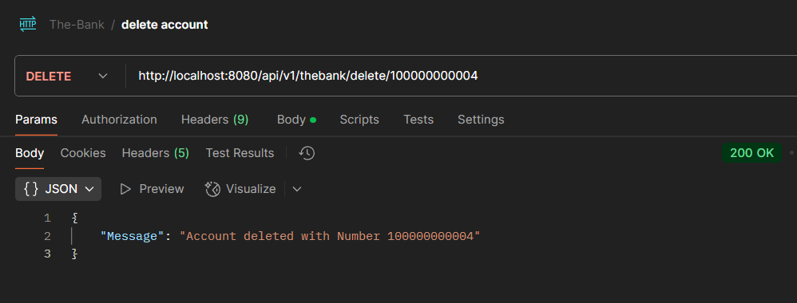

___

11. **Delete an account with no reacord**  
    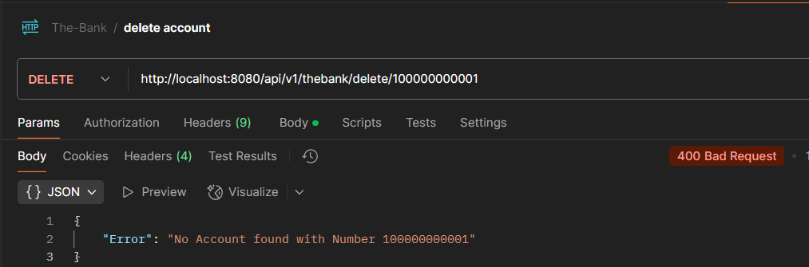

---

## Exception Handler

### steps for exception handling 
1. Creating custom exception named
   1. AccountException
      ```java
      package com.suraj.TheBank.exception;

      /// exception class for handling error related account
      public class AccountException extends RuntimeException {
      
      /// constructor
      public AccountException(String message) {
      super(message);
       }
      }
      ```
      
   2. MinBalanceException
      ```java
      package com.suraj.TheBank.exception;

      public class MinBalanceException extends RuntimeException {
      
          /// constructor
          public MinBalanceException(String message) {
              super(message);
          }
      }
      ```

2. creating ErrorDetails class(as a record class) to hold a response
     ```java
   package com.suraj.TheBank.exception;
   import java.time.LocalDateTime;
   
   /// record class for error details
   public record ErrorDetails(
           LocalDateTime timestamp,
           String message,
           String errorCode,
           String details
   ) {
   
   }
    ```
3. creating class GlobalExceptionHandler to handle specific and generic exceptions
    ```java
   package com.suraj.TheBank.exception;
   
   import org.springframework.http.HttpStatus;
   import org.springframework.http.ResponseEntity;
   import org.springframework.web.bind.annotation.ControllerAdvice;
   import org.springframework.web.bind.annotation.ExceptionHandler;
   import org.springframework.web.context.request.WebRequest;
   
   import java.time.LocalDateTime;
   
   @ControllerAdvice
   public class GlobalExceptionHandler {

    /// handel all account related exception
    @ExceptionHandler(AccountException.class)
    public ResponseEntity<ErrorDetails> handelAccountException(AccountException exception, WebRequest webRequest) {
        ErrorDetails errorDetails = new ErrorDetails(
                LocalDateTime.now(),
                exception.getMessage(),
                "ACCOUNT_NOT_FOUND",
                webRequest.getDescription(false)
        );

        return new ResponseEntity<>(errorDetails, HttpStatus.NOT_FOUND);
    }


    /// handel generic exception
    @ExceptionHandler(Exception.class)
    public ResponseEntity<Exception> handelGenericException(Exception exception, WebRequest webRequest) {
        ErrorDetails errorDetails = new ErrorDetails(
                LocalDateTime.now(),
                exception.getMessage(),
                "INTERNAL_SERVER_ERROR",
                webRequest.getDescription(false)
        );

        return new ResponseEntity<>(exception, HttpStatus.INTERNAL_SERVER_ERROR);
    }

    /// minimum required balance in account
    @ExceptionHandler(MinBalanceException.class)
    public ResponseEntity<ErrorDetails> handelMinBalanceException(MinBalanceException minBalanceException, WebRequest webRequest) {
        ErrorDetails errorDetails = new ErrorDetails(
                LocalDateTime.now(),
                minBalanceException.getMessage(),
                "MIN_BALANCE_ERROR",
                webRequest.getDescription(false)
        );

        return new ResponseEntity<>(errorDetails, HttpStatus.BAD_REQUEST);
    }
   }
    ```
   
4. **usage**
   1. **account not found error**
      ```java
       /// find account by id
      @Override
      public AccountDto findMyAccount(long accountNumber) {
      Account acc = repo.findById(accountNumber).orElseThrow(() -> new AccountException("Your account is not associated with our bank"));
   
           return mapper.entityToDto(acc);
      }
      ```
   2. **minimum balance error**
      ```java
      /// withdraw money from an account
      @Override
      public Map<String, String> withdrawMoney(long accountNumber, Double amount) {
  
          Account account = repo.findById(accountNumber).orElseThrow(() -> new AccountException("Your account is not associated with our bank"));
  
          Map<String, String> map = new HashMap<>();
  
          double prev = account.getBalance();
          double total = prev - amount;
  
          /// minimum 500 balance should be there
          if (prev - 500 >= amount) {
              account.setBalance(total);
              repo.save(account);
  
              map.put("Message", "Dear " + account.getName() + " Rs " + amount + " debited from your account. Available balance RS " + total);
          } else {
              throw new MinBalanceException("Dear " + account.getName() + " Available balance RS " + prev + ", Max Withdrawal RS " + (prev - 500));
          }
          return map;
      }
      ```
### output screens
1. **find an Account**  
   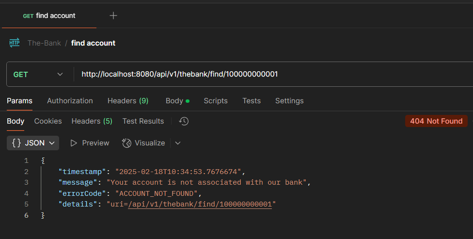

___

2. **deposit an amount**  
   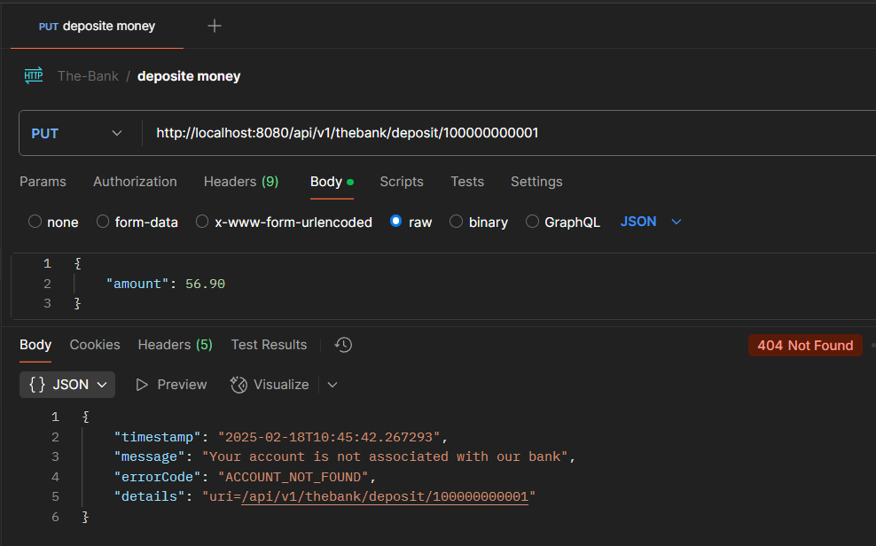

___

3. **withdraw amount**  
   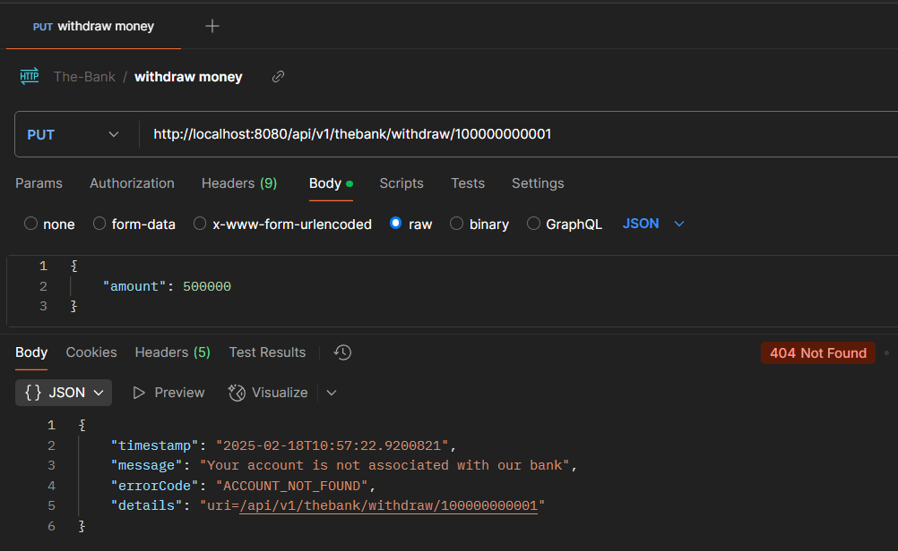

___

4. **Minimum balance 500RS**  
   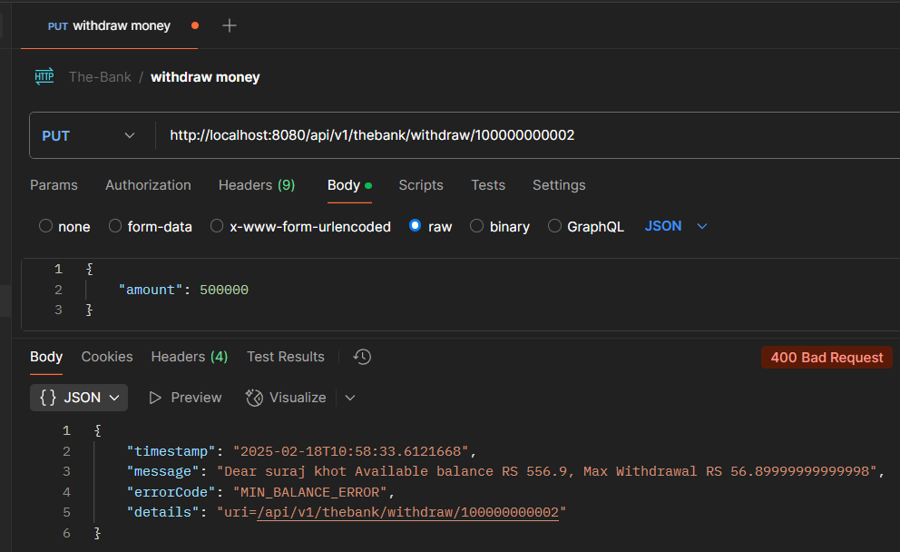

___

5. **Delete Account**  
   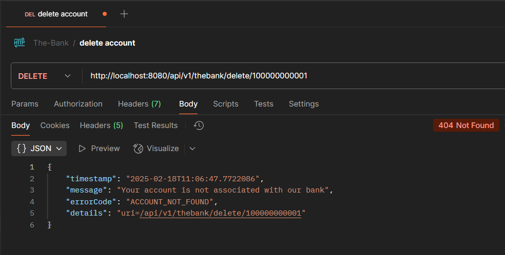
---
## End Of Project

**Author:** Suraj Khot  
**Tech Stack:** Spring Boot, MySQL, Java, REST API

---
___
